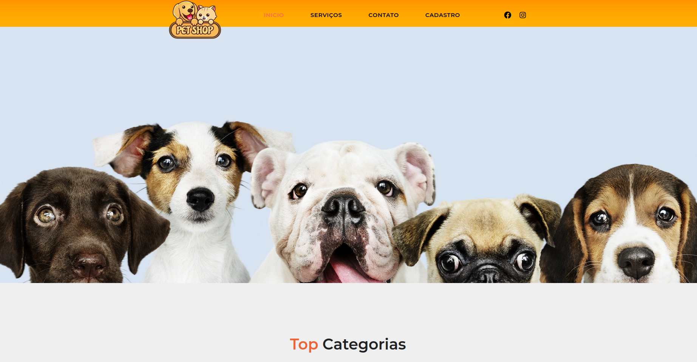

---

---

<h4 align="center"> 
	🚧 PETSHOP SITE 🚧

	

 <a href="#-sobre-o-projeto">Sobre</a> •
 <a href="#-funcionalidades">Funcionalidades</a> •
 <a href="#-layout">Layout</a> • 
 <a href="#-como-executar-o-projeto">Como executar</a> • 
 <a href="#-tecnologias">Tecnologias</a> • 
 <a href="#user-content--licença">Licença</a>

## 💻 Sobre o projeto

🐾 Descubra um mundo de cuidado e comodidade para seus pets com o site intuitivo de petshop! 🐶🐱✨

---

## ⚙️ Funcionalidades

- [X] Tela Inicial
- [X] Cadastro de Pets
- [X] Contato
- [X] Serviços

## 🛣️ Como executar o projeto

Frontend (arquivo index.html)

### Pré-requisitos

Não há.

## 🛠 Tecnologias

As seguintes ferramentas foram usadas na construção do projeto:

#### **Website**  (HTML + CSS + JAVASCRIPT)

- Editor:  **[Visual Studio Code](https://code.visualstudio.com/)** 
- Markdown:  **[StackEdit](https://stackedit.io/)**,  **[Markdown Emoji](https://gist.github.com/rxaviers/7360908)**
- Ícones:  **[Feather Icons](https://feathericons.com/)**
